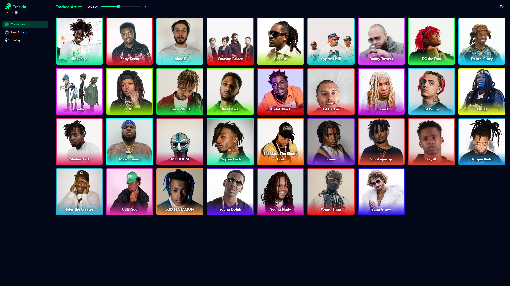
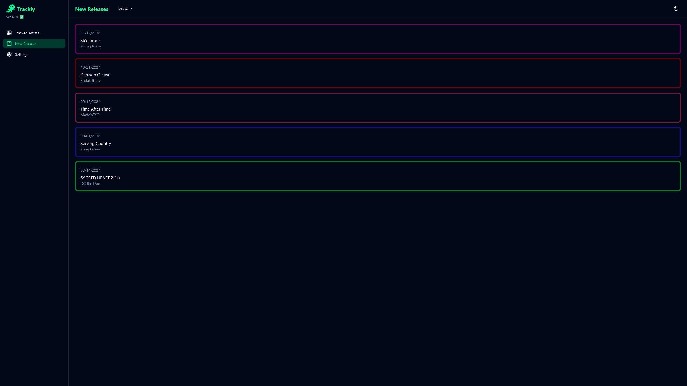
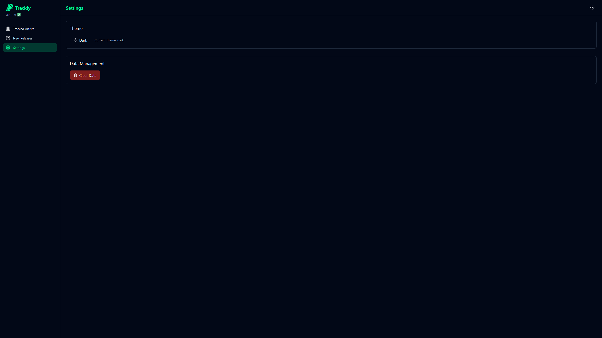
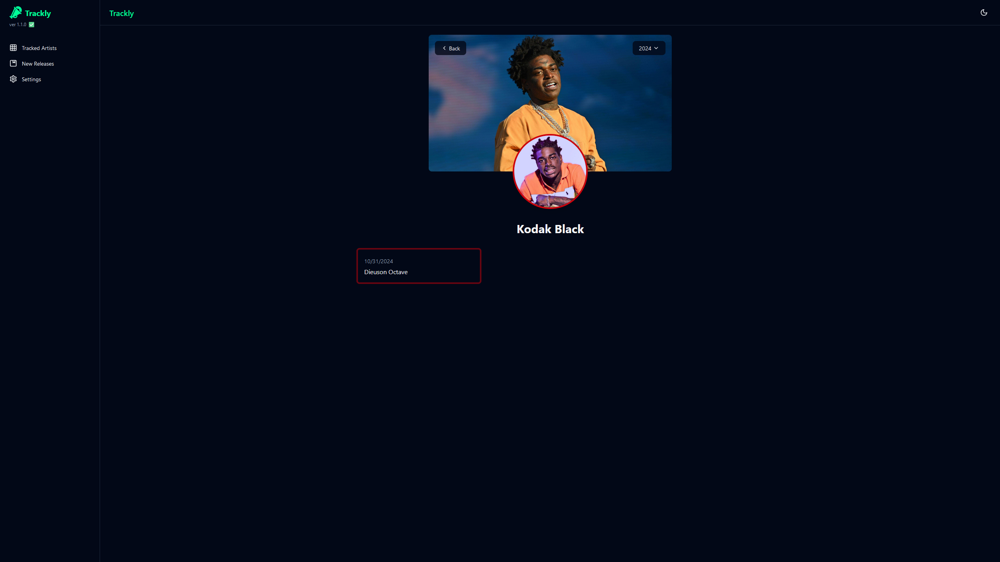
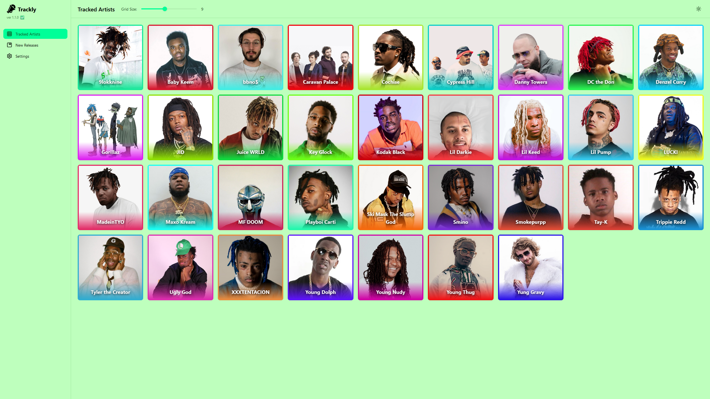
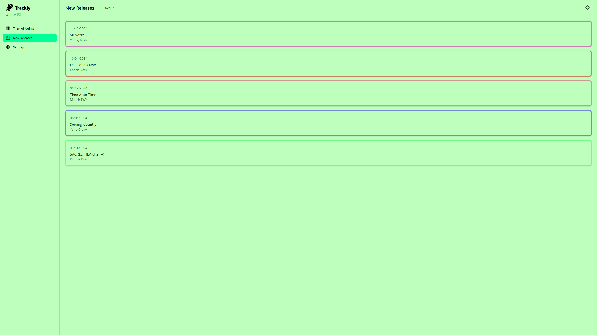
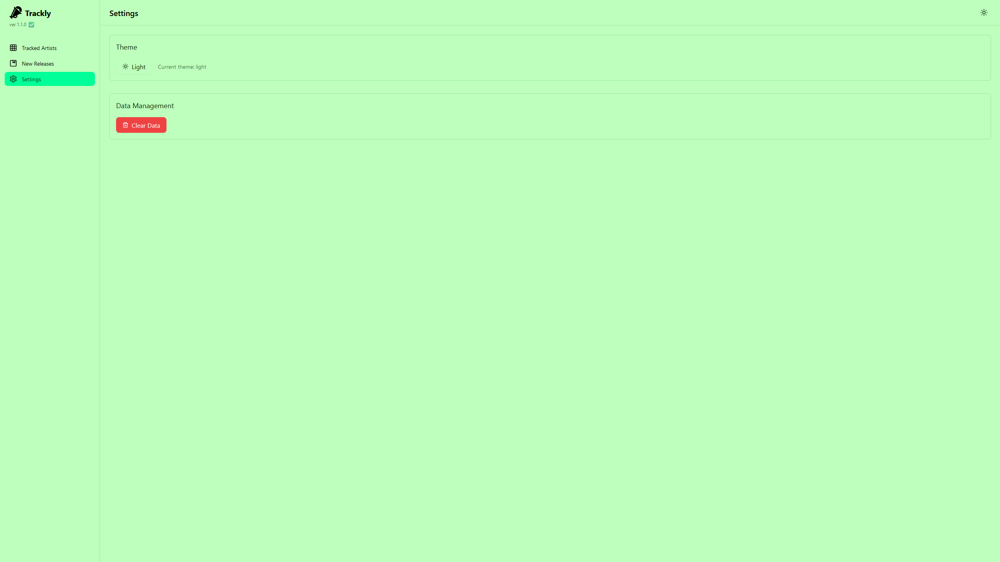
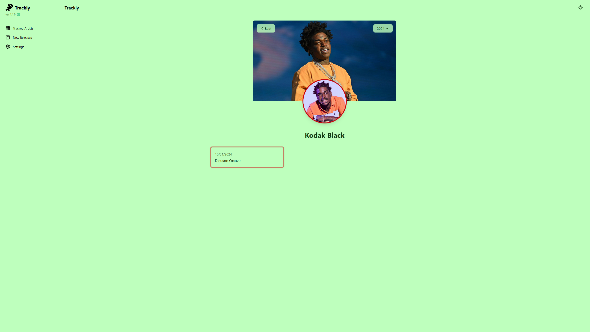

# 🖼️ Gallery 

A visual showcase of Trackly's interface in both dark and light themes.
## Dark Theme

### 1. Artists View (Dark)

### 2. Releases View (Dark)

### 3. Settings View (Dark)

### 4. Artist Details (Dark)

## Light Theme

### 1. Artists View (Light)

### 2. Releases View (Light)

### 3. Settings View (Light)

### 4. Artist Details (Light)
